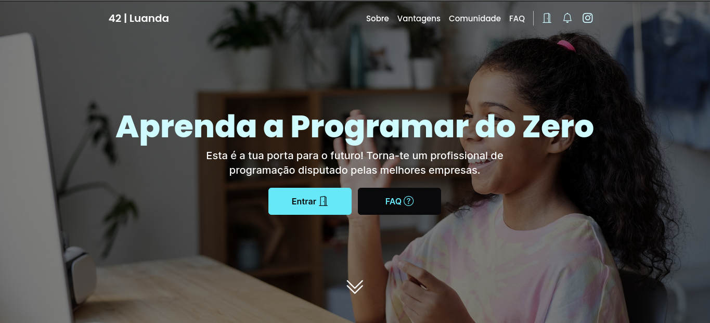
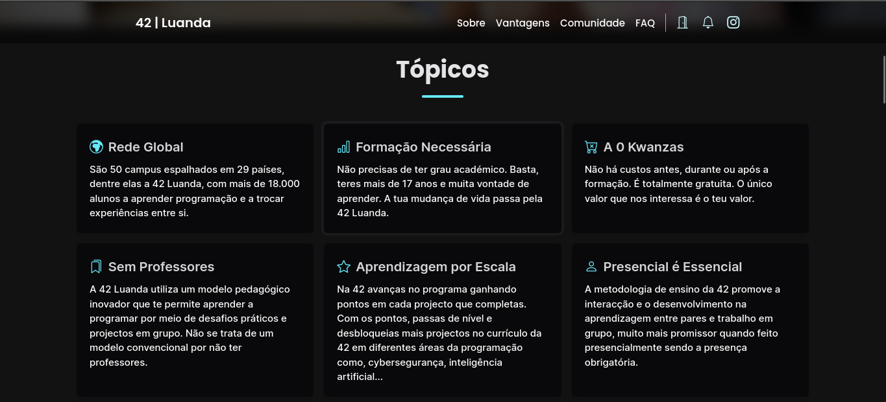
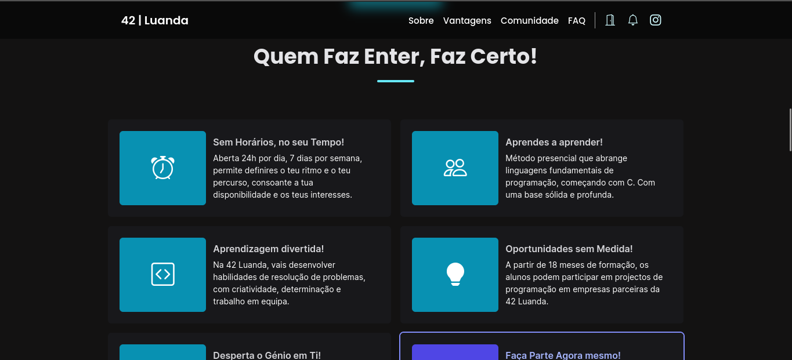
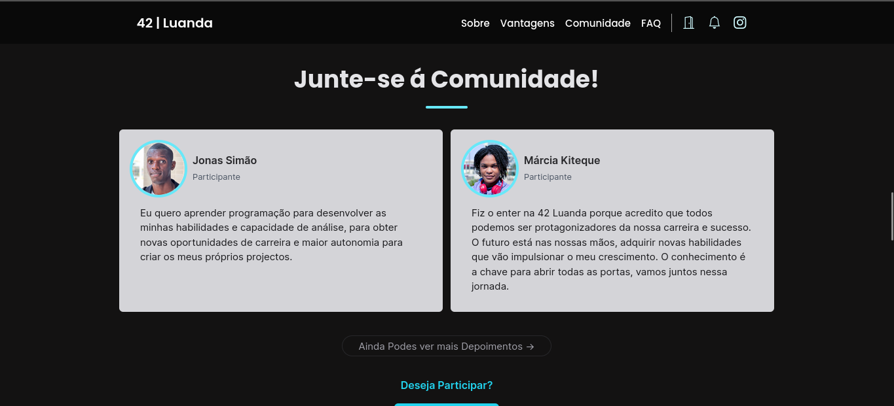
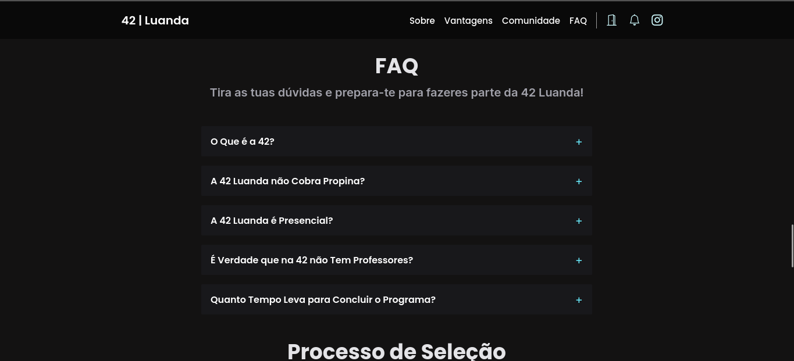
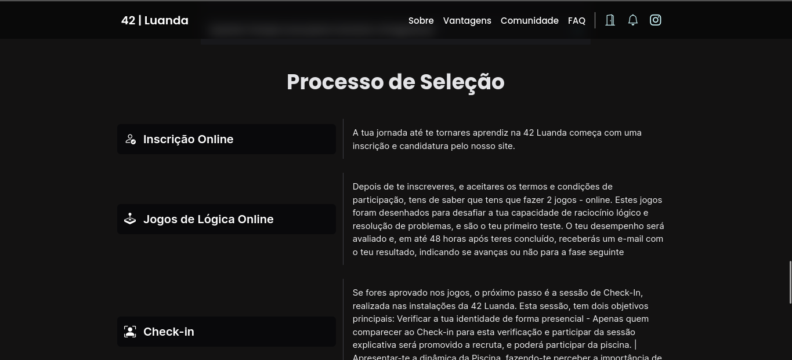
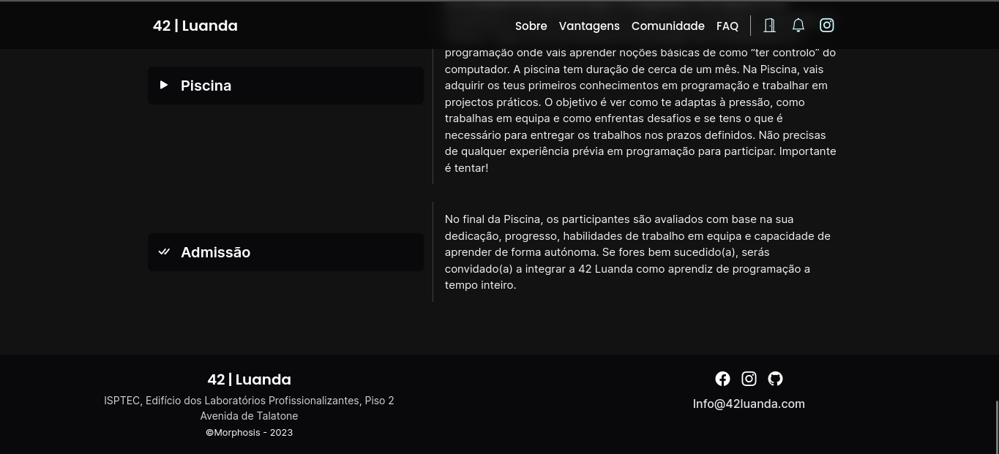

# ESTRUTURA DO SITE

Este Site pertence á Escola De Programação de Luanda e possui algumas Partes ou Destaques Principais como os
Tópicos, Vantagens, Comunidade e FAQ(perguntas Frequentes\*), tudo parte do Contexto que a Escola 42 pretende
Oferecer aos Candidatos.

# TECNOLOGIAS

-- Vite + VueJS
-- TAILWIND CSS(GRID, FLEX)
-- VANILLA

# ESTRUTURA DE PASTAS

Todos os Principais Arquivos estão na Pasta ./src, onde contém os Arquivos Estáticos, components e os Arquivos de
Inicialização.

# DESIGN E ESTILOS

Cores: #00ffff, #fff, #ccc, #000
Tipografia: Poppins, Inter

# IMAGENS

# LINKS

Repositório: https://github.com/mariosalembe23/42Luanda-Clone
URL LIVE:

